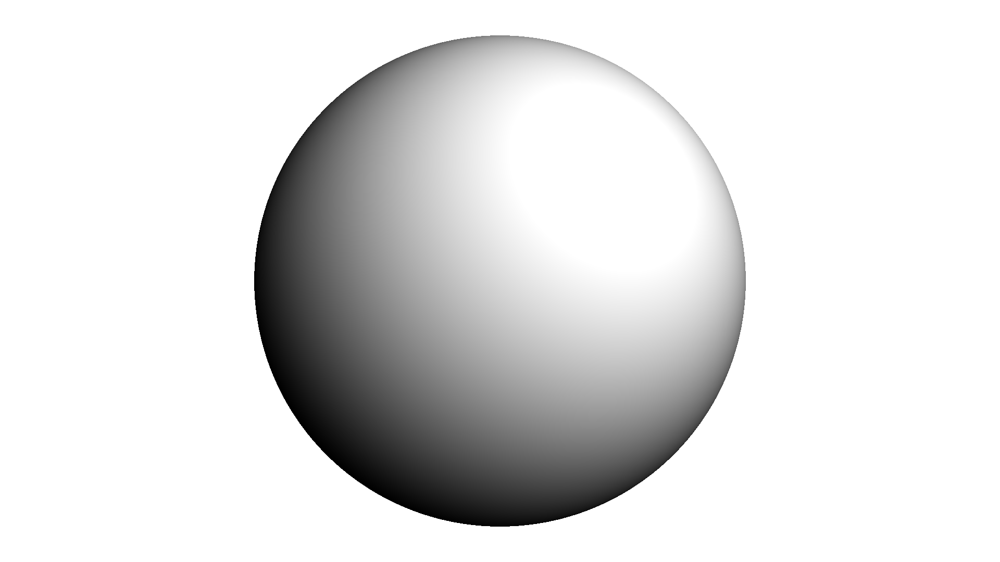
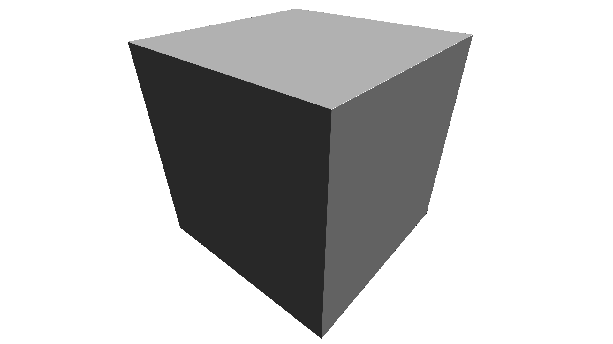

# 3D SDF Shapes

## Sphere


<figure>
  
</figure>

```glsl
float sdSphere(in vec3 p, float r) {
    return length(p) - r;
}
```

## Box

<figure>
  
</figure>

```glsl
float sdBox( vec3 p, vec3 b )
{
  vec3 q = abs(p) - b;
  return length(max(q,0.0)) + min(max(q.x,max(q.y,q.z)),0.0);
}
```

Credits: Inigo Quilez

## Cylinder

# Credits

 - https://www.iquilezles.org/www/articles/distfunctions/distfunctions.htm
